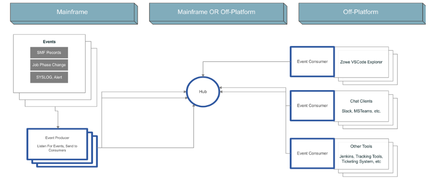

# Zowe Event Management Workgroup - 23PI3 - (2023/07/25 - 2023/10/23)

### Quick Background

- This workgroup was convened to investigate event management / event streaming technologies which satisfy use cases requiring push based notifications of platform events in real time, typically to off-platform technologies (Jenkins, Chat, Service Desk, etc.).
- Many existing products and vendors already have similar capabilities embedded within their deliverables, but they're rarely the same technology.
- We would like Zowe to set forward a standardized solution for surfacing and communicating Z events with off-platform technologies which can be used both by Zowe and by interested vendors / extenders. 

### Deliverables

- We currently envision a deliverable focused around 3 components:
  * Central Broker (Server-side hub)
  * Producer Library ( Zowe Wrapped OSS Library )
  * Consumer Library ( Zowe Wrapped OSS Library )

### Work Completed Last PI

* Initial Research - Background and Technical Landscape
  - Outcome: Moving forward with Kafka to the POC phase

### This PI

* Complete POC
  - Outcome: Make a recommendation for an implementation plan
  - Next Steps: WG results brought to TSC for review

### Stay in touch

* Meeting every other Tuesday during the Architecture call
* You can find our work:
    - [In this box folder](https://ibm.box.com/s/kiqa4qit4bcblnw466wiz3dkvvysofop)
    - [In this zowe/event-management-wg Repo](https://github.com/zowe/event-mangement-wg)

