# Zowe Techincal Community

This guide will help you navigate the Zowe community, and learn more on how to contribute and provide feedback.

## Techincal Community structure at a glance

## TSC

The Zowe Techincal Steering Committee (TSC) provides leadership to the Zowe community.

- [Current TSC members](tsc-voting-members.csv)
- [TSC Governance](process/tsc-governance.md)

## Squads

Squads are groups within the Zowe project that focus on certain areas of the Zowe project. Each squad is expected to operate in an open and transparent manner.

- [Current techincal Squads](squads)
- [Guidelines for Squads](squads/guidelines.md)

There are also squads for the operational functions of the Zowe project, which are defined at https://github.com/zowe/operations.

## Communication Channels

All community activities are scheduled on the [Zowe Community calendar](https://lists.openmainframeproject.org/g/zowe-dev/calendar). All meetings are an open invitation for any community member to join.

Official Zowe project communication channels are:

- [Slack](slack-channels.md)
- [Mailing Lists](mailing-lists.md)
- [Community Forum](community-forum.md)

## Contribute

Zowe is open to contributions from the community. Contribution guidelines are outlined at [CONTRIBUTING.md]

## Credits

The Zowe project was made possible by initial code contributions from CA Technologies (now Broadcom), IBM, and Rocket Software. Zowe is hosted by the Open Mainframe Project, which is a foundation within the Linux Foundation.

[Open Mainframe Project Slack]: https://slack.openmainframeproject.org
