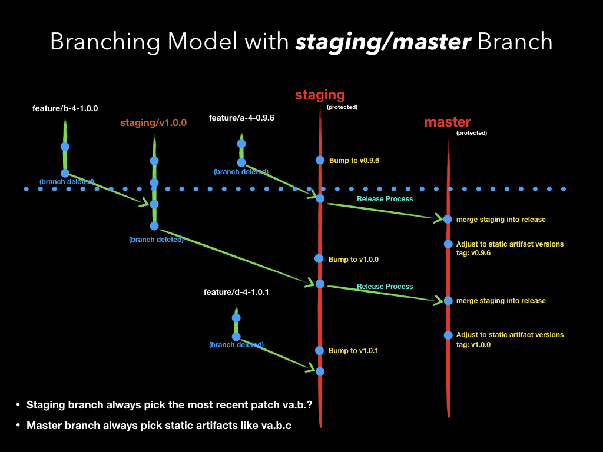
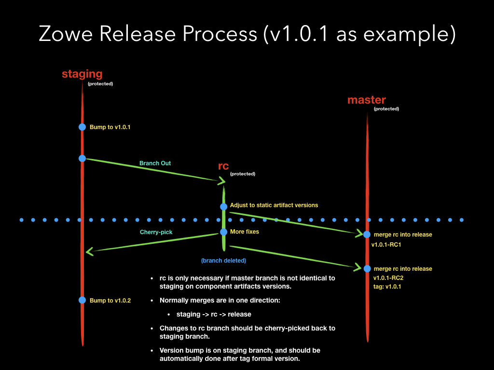
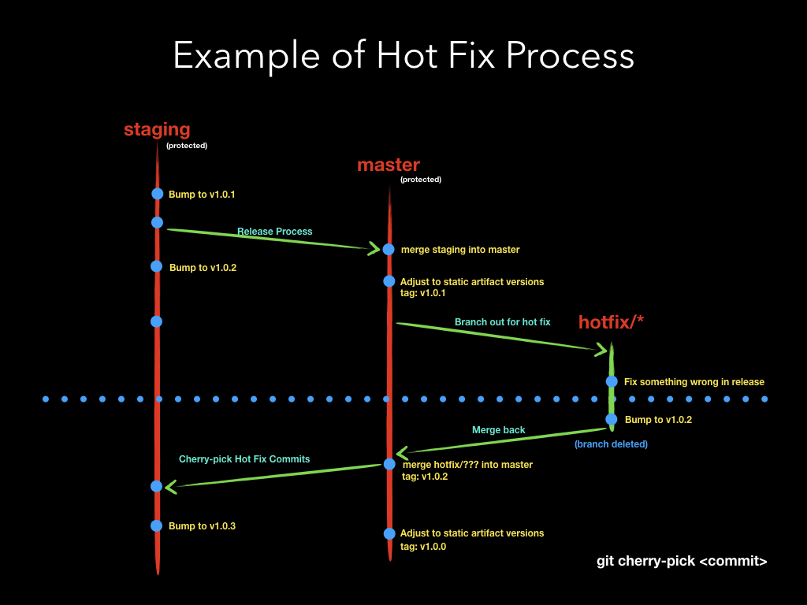

# Branches Guideline

This documentation introduces guideline for using branches in Zowe project, including all sub-projects. We try to keep consistent and apply the same branching model to all source code repositories. Subproject may use a different branch model to better suit its needs, but it should be properly documented. For example, Zowe CLI used a different [Versioning](https://github.com/zowe/zowe-cli/blob/master/docs/MaintainerVersioning.md) to better work with NPM package tags.

Zowe project follows [Semantic Versioning](https://semver.org). So all versions mentioned in this documentation follows `[major].[minor].[patch]` version pattern.

## Branching Model

### Base Branches

- Long-Lived Branches

  Branches listed below are mandatory and should exist all the time. These branches should be **protected** from updating. So any changes go into these branches should be through **Pull Request** and reviewed by other committers.

  * **main** - this is the main release branch. It contains the most recent stable formal release. The release tag is created on this branch. If the component has dependencies, only static version of dependent artifacts should be listed. For example, a dependency on another sub-project version `~5.2.0` (which means latest patch release of `5.2.*`) is not acceptable. This _master_ branch should not be merged back into _staging_ branch. In certain circumstances, we will _cherry-pick_ hot fixes back into _staging_ branch.
  * **staging** - this is the main development thread. It contains the most recent code for **next** (the coming) release. If the component has dependencies, dynamic patch-level version of dependent artifacts is recommended and acceptable. For example, `~5.2.0` is acceptable because it means `5.2.*`. But `^5.2.0` is not acceptable because it means `5.*`. This branch will be merged into _master_ branch during release process.

- Optional Ephemeral Branches

  All branches listed below are optional and created based on demand.

  * **rc** - this is an ephemeral branch used during release process. It holds the content of _staging_ branch, but has modifications on static component versions. After release is done, this branch will be deleted. This release branch is not necessary if staging and release branches are supposed to be  identical. Check [Release Process](#release-process) below for an example how the branch is used. 
  * **staging/\*** - these are staging branches for temporary purpose and created on-demand. `staging/` is the recommended branch name prefix. These branches are branched out from _staging_, and will be merged back into _staging_. After the branch is merged into _staging_, this branch should be removed. Check [Base master/staging Branches](#base-masterstaging-branches) below for an example how the branch is used. Here are several examples:
    - _staging/next-next_ - a staging branch for next-next release,
    - _staging/v1.2.3_ - a staging branch specifically for v1.2.3 release,
    - _staging/v1.3.x_ - this branch consolidate all features for `v1.3.0` release, the next MINOR level release,
    - _staging/v2.x_ - this branch consolidate all features for `v2.0.0` release, the next MAJOR level release,
    - _staging/sso_ - a staging branch consolidate all implementations, Pull Requests together related to SSO. But we are not sure when the feature will be mature enough to be released, and be merged into _staging_.
  * **hotfix/\*** - these are branches for hot fixes on _release_ branch. `hotfix/` is the recommended branch name prefix. Contrary to _staging/*_ These branches are branched out from _release_ branch, and will be merged back to _release_ branch. After hot fix is released, it will be _cherry-picked_ back into _staging_ branch. The hot fix release should  increase build patch version, and it supposes to happen between 2 scheduled releases. For example, hotfix/fix-component-version. Check [Hot Fix Process](#hot-fix-process) below for an example how the branch is used.
  * **feature/\*** - these are branches for new features. `feature/` is the recommended branch name prefix. For example, feature/enable-sso. Normally if a release has this kind of branches merged into _staging_, we should have a MINOR release because we have function improvements to the product.
  * **bug/\*** - these are branches for bug fixes in _staging_ branch. Comparing to hot fixes, these bug fixes will be merged into _staging_ branch. `bug/` is the recommended branch name prefix. For example, bug/fix-permission. Normally if a release only has this kind of branches merged into _staging_, we can have a PATCH release because we only have bug fixes to the product.
  * **user/\*/\*** - these are branches for personal testing purpose. `users/*/` is the recommended branch name prefix. For example, users/jack/test-pipeline.

### Branches for LTS (Long-Time-Support) Versions

With an example of main thread are ready for v2.x release, then v1.x became LTS version and will be archived. We will follow same pattern as main thread but prefix branch names with `v1.x/`.

- Long-Lived Branches

  * **v1.x/main** - branched out from _main_ branch.
  * **v1.x/staging** - branched out from _staging_ branch.

- Optional Ephemeral Branches

  * **v1.x/rc**
  * **v1.x/staging/\***
  * **v1.x/hotfix/\***
  * **v1.x/feature/\***
  * **v1.x/bug/\***
  * **v1.x/user/\*/\***

All the _v1.x/*_ branches serve the same purpose as base branches, but only for `v1.x` releases.

## Common Branch Operation Scenario

### Base master/staging Branches

- At the time of blue dotted line, _staging_ is prepared to release `v0.9.6`.
- A feature _feature/b-4-1.0.0_ is implemented and will be merged into _staging/v1.0.0_ to avoid mess up `v0.9.6` release.
- After `v0.9.6` is released, a tag will be created on _master_ branch.
- _staging_ branch will be automatically bumped one patch level up after release.
- Then _staging/v1.0.0_ branch will be merged into _staging_.
- After merge, _staging/v1.0.0_ branch will be deleted.

### Release Process

- _rc_ is branched out from _staging_ when we are ready to start the release process.
- At the time of blue dotted line, _rc_ is updated to use static component artifact versions.
- _rc_ will be merged into _master_ and be announced as RC1.
- If we found issues in RC1, we will do the fix in _rc_ branch.
- The _rc_ will be merged into _master_ again to announce RC2.
- The fixes on _rc_ branch will be cherry-picked into _staging_ branch.
- Do not merge _rc_ back to _staging_ branch to avoid we accidently update _staging_ branch with static artifact versions.
 
### Hot Fix Process

- _hotfix/*_ is branched out from _master_ after we found a must-fix bug on the most recent release.
- At the time of blue dotted line, _hotfix/*_ is updated with desired fix.
- _hotfix/*_ will bump the release version to next PATCH number. At this time, _hotfix/*_ should have same version number as _staging_ branch.
- Merge _hotfix/*_ branch back to _release_ branch, release and tag.
- Cherry-pick the fix to _staging_ branch and bump _staging_ to next PATCH number.
- _hotfix/*_ only happens between two scheduled releases.
- _hotfix/*_ does not fix issues on other releases except for the most recent one. 
