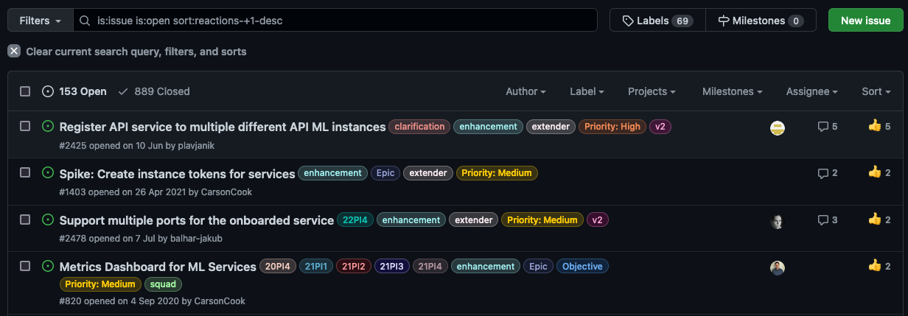

# Issues

All Zowe project squads use GitHub to track issues raised against projects that the squad is responsible for. Issues could be questions, bug reports, request for enhancements, and others.
Every squad responds as outlined below. 

Squads can specify issue details that relate to a specific project within the project
repository in the ISSUES.md file located in the root of the repository. 

Every squad is expected to triage new issues at regular squad meetings. The triage process should result 
in issue categorization: bug, enhancement, question, other as well as either clarification or issue prioritization: critical, high, medium, low.

Triaging of an issue is performed by attaching labels to the issue (see the recommended set of labels presented in this topic):

- **new**  
 The issue has not yet been triaged

Types of the issues:

- **enhancement**  
A request to provide a new functionality. See the [recommended template](https://github.com/zowe/api-layer/blob/v2.x.x/.github/ISSUE_TEMPLATE/feature_request.md). 
- **question**  
A question about how something works in the specific projects. See the [recommended template](https://github.com/zowe/api-layer/blob/v2.x.x/.github/ISSUE_TEMPLATE/question.md).
- **bug**  
A defect found in one of the existing project functionalities. See the [recommended template](https://github.com/zowe/api-layer/blob/v2.x.x/.github/ISSUE_TEMPLATE/bug_report.md).

## Triaging Guidelines: *Bugs*

Importance of the issue as perceived by squad:

- **priority-critical**  
*Address Immediately*: The submitter has indicated (or the reviewer has judged) that the defect is causing significant detrimental impact such as production outage, data corruption, security exposure, etc. The issue should be pulled in immediately and resolved. If this is not possible, the issue should be escalated to the TSC immediately.
- **priority-high**  
*Address in this PI (instead of stretch goals) or plan for next PI*: The submitter has indicated or confirmed that this defect is EITHER not causing significant detrimental impact such as production outage, data corruption, security exposure - OR is and does not require immediate attention. However, the technology is not functioning properly and the impact to usage is significant. The issue should be considered and planned for this PI (if possible) or the next PI, provided that other higher or equivalent priority defects have not utilized available capacity.
- **priority-medium**  
*Address in the next 6 - 12 months*: The submitter has indicated or confirmed that this issue is not causing significant detrimental impact - however, the technology is not functioning properly and the impact to usage could be significant. The issue should be considered and planned for an upcoming PI, provided that other higher or equivalent priority defects have not utilized available capacity.
- **priority-low**  
*Address in the next 12 months*: The submitter has indicated or confirmed that this defect is not causing significant detrimental impact and the impact to usage is manageable. The issue should be prioritized and planned based on popularity (see voting), capacity, and submitter-availability for engagement and participation in the resolution.

For bugs, apply a severity label based on the following criteria:

- **severity-critical**  
*Prevents Use of Zowe*: Major impact on the organization (i.e., production outage, data corruption, security exposure)
- **severity-high**  
*Limits Use of Zowe / no (or limited) workaround*: Large impact to usage, workaround may exist but limits usage
- **severity-medium**  
*Limits Use of Zowe / workaround*: Large impact to usage, workaround fixes the defect but makes usage more complex 
- **severity-low**  
*Uncomfortable Use of Zowe*: Low impact to usage, does not impact key use cases, workaround may exist

## Triaging Guidelines: *Enhancements*

Importance of the issue as perceived by squad:

- **priority-critical**  
*Address Immediately*: The submitter has indicated (or the reviewer has judged) that the enhancement is necessary to PREVENT significant detrimental impact to their usage and or their system which may result in production outage, data corruption, security exposure, etc. The enhancement should be pulled in immediately to be addressed. If this is not possible, the enhancement should be escalated to the TSC immediately. Submitter should commit to engagement throughout the development and validation of the enhancement (exceptions may apply).
- **priority-high**  
*Address in this PI (instead of stretch goals) or plan for next PI*: The submitter has indicated or confirmed that this enhancement is necessary to prevent significant impact to usage, production rollout and/or adoption. The enhancement should be considered and planned for this PI (if possible) or the next PI, provided that other higher or equivalent priority defects or enhancements have not utilized available capacity. Submitter must commit to engagement throughout the development and validation of the enhancement.
- **priority-medium**  
*Address in the next 12 months*: The submitter has indicated or confirmed that the enhancement is necessary to improve usage and further adoption. The enhancement should be considered and planned for an upcoming PI, provided that other higher or equivalent priority defects or enhancements have not utilized available capacity. Submitter must commit to engagement throughout the development and validation of the enhancement.
- **priority-low**  
*Address as capacity permits*: The submitter has indicated or confirmed that this enhancement is either more cosmetic or a nice-to-have improvement. The issue should be prioritized and planned based on popularity (see voting), capacity, and submitter-availability for engagement and participation in the resolution.

### *Severity does not apply to enhancements*

## Issue Management

When determining the next issue to work on, the squad takes into account the level and type of engagement, as well as the willingness 
of the author to assist with resolving the issue. One way to show interest is to use a thumbs-up emoji. The number of thumbs-ups users assign to a specific issue is visible on the issues tab in Github as shown in figure 1.

Issues are organized into larger projects shown as epics on the Zenhub board whenever appropriate. An example of an epic within Zenhub is shown in figure 2. 

Every issue is to be triaged within a maximum of 90 days since the creation of the issue. 

The issues that are older than 180 days are to be triaged at least once every PI unless they are associated with an 
existing Epic, Milestone, or other means that the squad uses to organize issues into larger projects. Issues are either kept, linked to an epic or milestone or closed if they are no longer considered relevant by the squad. 

To clarify the state of issues, the TSC, as part of the TSC Update during the PI Planning, shares and comments on the current state of our projects. 
