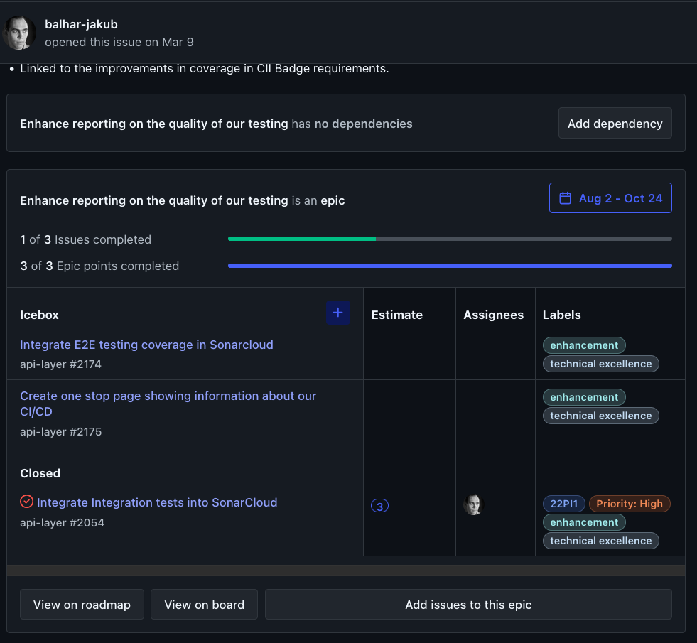

# Issues

All the squads within the Zowe projects use GitHub to track the issues raised against the projects
they are responsible for. The issues could be questions, bug reports, request for enhancements and others.
Every squad responds to the new issues within the 90 days of the creation of the issue. 

The squads can specify the details of the issue processing for specific project within the project
repository in the ISSUES.md file in the root of the repository. 

Every squad is expected to have at least one weekly meeting. The meeting should among other responsibilities
triage the new issues and decide what to do with the issues. 

The triage of the issues is done via attaching the labels to the issues. The recommended labels to use are:

- new - The issue wasn't triaged yet 

Types of the issues:

- enhancement - Request to provide new functionality. [The recommended template](https://github.com/zowe/api-layer/blob/v2.x.x/.github/ISSUE_TEMPLATE/feature_request.md) 
- question - Question around how something works in the specific projects. [The recommended template](https://github.com/zowe/api-layer/blob/v2.x.x/.github/ISSUE_TEMPLATE/question.md)
- bug - Defect found in one of the existing functionalities within the project. [The recommended template](https://github.com/zowe/api-layer/blob/v2.x.x/.github/ISSUE_TEMPLATE/bug_report.md)

Importance of the issue as perceived by squad organized by importance:

- priority-critical - An issue that needs to be resolved within this PI, ideally within next sprint
- priority-high - An important issue that should be at least considered for the next PI, ideally within this one, if there is spare capacity
- priority-medium - An issue that isn't very important so it will be planned in the PI, once there are no more important issues
- priority-low - An issue that is recognized by the squad but that is not considered very important 

For Bugs it's also possible to reflect the perceived impact of the issue by its severity:

- severity-critical - A bug that has major impact on the organization preventing the usage of Zowe
- severity-high - A bug for which there may be workaround but limits the usage of the Zowe for major use cases
- severity-medium - A bug where workaround exists or that doesn't prevent the usage of the Zowe or the use case, just make it more complex
- severity-low - A bug that makes the usage of the Zowe less convenient but doesn't impact key use cases

When figuring out the next issue to work on the squad take into account the amount of thumbs-ups the users gave
to the specific issue. The squad can find the information on the issues tab in the Github as shown on the figure 1.

The issues are organized into larger projects shown as epics on the Zenhub board whenever appropriate. The example of 
epic within Zenhub is shown on the figure 2. 

The isues that are older than 180 days will be triaged at least once every PI unless they are associated with 
existing Epic, Milestone or other means squad uses to organize the issues into larger projects. The issues are either kept, linked to an epic, milestone or closed if they aren't considered relevant by the squad 
anymore. 
