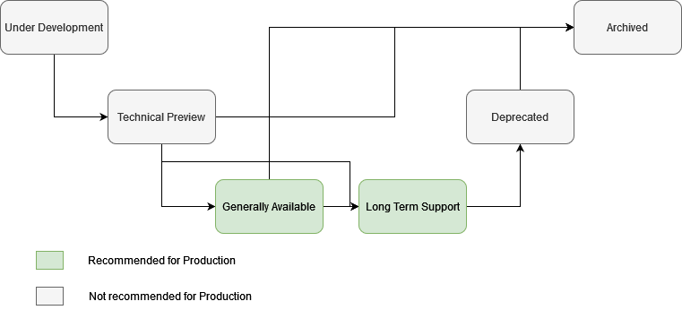

# Projects

The code within the Zowe is structured into projects. Some projects belong to the Core of the Zowe and projects that are Extensions of Zowe. Every project is owned by one of the squads. A squad may own more than one project. The project consists of one or more components. 

The information about the highest achieved lifecycle stage and the information about versions are [here](versions.md).

## Versioning

Zowe consists of multiple projects. Each project is versioned and follows semantic versioning. A specific version of Zowe is a collection of projects in concrete versions. The project versions don't have to be the same as for Zowe. 

Every project has an active major version. This version receives updates containing new functionality in minor and patch version updates. Long Term Support projects also can have a maintenance major version. The maintenance version is supported and receives security-related fixes as patch versions.

The community supports projects on a best effort basis for the last minor version introduced within the active and maintenance major versions. 

## Lifecycle

The projects are going through the six stages of their lifecycle. The image shows possible transitions. More details for the transitions are in the details of the stage. 

- Under Development
- Technical Preview
- Generally Available (GA)
- Long Term Support (LTS)
- Deprecated
- Archived

### Under Development

#### Purpose

To let developers know that something is going on and that they can join the effort. To let the users and extenders know that such a project may become available in the future. 

#### Timeline

As long as it takes to move the project to at least the Technical Preview stage.

#### Support

The project in this stage isn't ready to be deployed, and as such, there is no support other than reaching out directly to the developers. 

#### Recommended Use

Help with the development of the functionality. 

#### Possible transitions

- From Under Development to Technical Preview means that the project is ready for validation by customers
- From Under Development to Generally Available means that the project received the needed feedback already in the Under Development phase and is ready to be put into production

### Technical Preview

#### Purpose

To gather feedback on the project from potential future users and extenders. The further minor releases to the projects in technical preview may contain breaking changes. 

#### Timeline

As long as necessary to move the project to at least the Generally Available stage. The project shouldn't stay in this phase longer than a year. If this is the case, it's possible to return the project to Under Development.  

#### Support

The project is ready for the test and validation environments. The support is still provided on the best effort basis for the last version in which the technical preview was available. The project still can be moved back into Under Development or directly Archived.

#### Recommended Use

Put the project in testing and validation environments and provide feedback to Zowe to improve the project. 

#### Possible transitions

- From Technical Preview to Generally Available means that the project received the needed feedback and is ready to be put into production
- From Technical Preview to Long Term Support means that the project is stable and mature. It belongs to the production
- From Technical Preview to Archived means that after the feedback from the customers, the project found that it's not a good fit and the development won't continue

### Generally Available

#### Purpose

To gather more feedback and improve the project before stabilizing it for Long Term Support. The project is stable, and we don't expect major changes, but unlike for Long Term Support, the changes may be needed. We believe that it's ok for GA products to become part of the production environments. The project may need to release major versions with breaking changes more often than the projects in Long Term Support. There should be no breaking changes in the minor releases.

#### Timeline

Supported for at least six months with updates. It may become LTS during this time, and the LTS rules will apply. 

#### Support

The community will support GA projects for at least six months after the initial release. Afterward, with the next major Zowe release version, the latest, the project should also become LTS or Archived if it didn't succeed.

#### Recommended Use

Put the project in the test, validation, and production environments. Provide feedback to the Zowe to improve the project. 

#### Possible transitions

- From Generally Available to Technical Preview means that we found out, based on the customer feedback, that the project needs a major rework for a longer life 
- From Generally Available to Long Term Support means that the project is stable and mature. It belongs to the production 
- From Generally Available to Archived means that the project wasn't a good fit and, as such, won't be further developed

### Long Term Support

#### Purpose

The most stable version doesn't necessarily contain the latest and newest functionality, but it's ready to be deployed to the production environments. The Long Term Support is the most stable and longest supported version of any project. There are no breaking changes allowed within the major release. 

#### Timeline

The timeline is based on the Core Zowe release. We expect the LTS to be linked to the Core Zowe release cycle. So it will live in the same way as the major Zowe release it first became part of. 

#### Support

Much longer window and well-defined calendar. The active phase of the project depends on when it joins the Zowe, but the maintenance will be at least two and a half years with deprecation in the next major version if it was removed at some point in time. 

**Note:** Projects that are part of the Core and reach Long Term Support needs to be supported by the conformant support providers. 

#### Recommended Use

Put the project in the Production environment. The project is stable and mature. 

#### Possible transitions

- From Long Term Support to Deprecated means that the project is no longer relevant and, as such, will be removed in the next major version. 

### Deprecated

#### Purpose

To provide more extended support and give the customers time to prepare before sunsetting a specific project. There are no breaking changes allowed within the major release boundary.

#### Timeline

In general, it is linked to the Zowe Core release cycle. Therefore it happens on the major version boundary and lasts until the maintenance phase of the version ends.

#### Support

During the deprecated phase, no new development is happening. Only critical and security fixes are provided in the same way as the Maintenance phase. 

#### Recommended Use

Remove the project from the Production environment as the project will be removed from Zowe. 

#### Possible transitions

- From Deprecated to Archived means that the project development and support won't continue

### Archived

#### Purpose

To keep the history of what we tried and what was used at some point. 

#### Timeline

The source code will be kept as long as deemed relevant for archivation purposes. 

#### Support

There is no support and no guarantee for projects at this stage. The build infrastructure isn't owned and maintained by the community. 

#### Recommended Use

None. Don't use the projects in this stage. 

#### Possible transitions

- To Under Development in case the product attracts developers and users for creating a new version
- To Technical Preview in case the product was inactive, and the last released version is seeking feedback when the project becomes active again

### Example

#### Standard Lifecycle process

Zowe Acme project was proposed by one of the TSC members and is accepted as a new project by one of the active squads or has its own Incubator Squad (Squad lifecycle is explained in [squads.md](https://github.com/zowe/community/blob/master/Technical-Steering-Committee/squads.md)). The group of developers behind the project works on the first version, which means the product is Under Development. After half of the year of development, the technical preview for the first version is prepared and published as Technical Preview to gather more feedback from the users. The developers get feedback
from the users and update the project. Afterward, they publish the first version as the Generally Available. The Generally Available
version of the project gains traction and users, and as such, the project is moved to Long Term Support. This way, it joins the currently Active 
major version of Zowe. After two major versions, the programming landscape changes, and as such, the project isn't used much anymore, and 
the group of developers working on the project gets smaller and smaller. Therefore, the project is Deprecated for the next major version, and after the maintenance time of this major version passes, it gets archived. 
