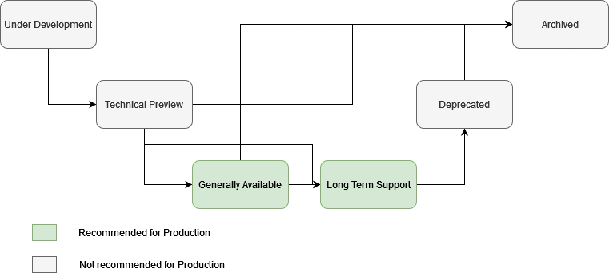

# Projects

The code within the Zowe is structured into projects. Some projects belong to the Core of the Zowe and projects that are Extensions of Zowe. Every project is owned by one of the squads. A squad may own more than one project. The project consists of one or more components. 

The information about the highest achieved lifecycle stage and the information about versions are [here](versions.md).

## Versioning

Zowe consists of multiple projects. Each project is versioned and follows semantic versioning. A specific version of Zowe is a collection of projects in concrete versions. The project versions don't have to be the same as for Zowe. 

Every project has an active major version. This version receives updates containing new functionality in minor and patch version updates. Long Term Support projects also can have a maintenance major version. The maintenance version is supported and receives security-related fixes as patch versions.

The community supports projects on a best effort basis for the last minor version introduced within the active and maintenance major versions. 

## Lifecycle

The projects are going through the six stages of their lifecycle. The image shows possible transitions. More details for the transitions are in the details of the stage. 

- Under Development
- Technical Preview
- Generally Available (GA)
- Long Term Support (LTS)
- Deprecated
- Archived

### Under Development

#### Purpose

To let developers know that something is going on and that they can join the effort. To let the users and extenders know that such a project may become available in the future. 

#### Timeline

As long as it takes to move the project to at least the Technical Preview stage.

#### Support

The project in this stage isn't ready to be deployed, and as such, there is no support other than reaching out directly to the developers. 

#### Recommended Use

Help with the development of the functionality. 

#### Possible transitions

- From Under Development to Technical Preview means that the project is ready for validation by customers
- From Under Development to Generally Available means that the project received the needed feedback already in the Under Development phase and is ready to be put into production

### Technical Preview

#### Purpose

To gather feedback on the project from potential future users and extenders. The further minor releases to the projects in technical preview may contain breaking changes. 

#### Timeline

As long as necessary to move the project to at least the Generally Available stage. The project shouldn't stay in this phase longer than a year. If this is the case, it's possible to return the project to Under Development.  

#### Support

The project is ready for the test and validation environments. The support is still provided on the best effort basis for the last version in which the technical preview was available. The project still can be moved back into Under Development or directly Archived.

#### Recommended Use

Put the project in testing and validation environments and provide feedback to Zowe to improve the project. 

#### Possible transitions

- From Technical Preview to Generally Available means that the project received the needed feedback and is ready to be put into production
- From Technical Preview to Long Term Support means that the project is stable and mature. It belongs to the production
- From Technical Preview to Archived means that after the feedback from the customers, the project found that it's not a good fit and the development won't continue

### Generally Available

#### Purpose

To gather more feedback and improve the project before stabilizing it for Long Term Support. The project is stable, and we don't expect major changes, but unlike for Long Term Support, the changes may be needed. We believe that it's ok for GA products to become part of the production environments. The project may need to release major versions with breaking changes more often than the projects in Long Term Support. There should be no breaking changes in the minor releases.

#### Timeline

Supported for at least six months with updates. It may become LTS during this time, and the LTS rules will apply. 

#### Support

The community will support GA projects for at least six months after the initial release. Afterward, with the next major Zowe release version, the latest, the project should also become LTS or Archived if it didn't succeed.

#### Recommended Use

Put the project in the test, validation, and production environments. Provide feedback to the Zowe to improve the project. 

#### Possible transitions

- From Generally Available to Technical Preview means that we found out, based on the customer feedback, that the project needs a major rework for a longer life 
- From Generally Available to Long Term Support means that the project is stable and mature. It belongs to the production 
- From Generally Available to Archived means that the project wasn't a good fit and, as such, won't be further developed

### Long Term Support

#### Purpose

The most stable version doesn't necessarily contain the latest and newest functionality, but it's ready to be deployed to the production environments. The Long Term Support is the most stable and longest supported version of any project. There are no breaking changes allowed within the major release. 

#### Timeline

The timeline is based on the Core Zowe release. We expect the LTS to be linked to the Core Zowe release cycle. So it will live in the same way as the major Zowe release it first became part of. 

#### Support

Much longer window and well-defined calendar. The active phase of the project depends on when it joins the Zowe, but the maintenance will be at least two and a half years with deprecation in the next major version if it was removed at some point in time. 

**Note:** Projects that are part of the Core and reach Long Term Support needs to be supported by the conformant support providers. 

#### Recommended Use

Put the project in the Production environment. The project is stable and mature. 

#### Possible transitions

- From Long Term Support to Deprecated means that the project is no longer relevant and, as such, will be removed in the next major version. 

### Deprecated

#### Purpose

To provide more extended support and give the customers time to prepare before sunsetting a specific project. There are no breaking changes allowed within the major release boundary.

#### Timeline

In general, it is linked to the Zowe Core release cycle. Therefore it happens on the major version boundary and lasts until the maintenance phase of the version ends.

#### Support

During the deprecated phase, no new development is happening. Only critical and security fixes are provided in the same way as the Maintenance phase. 

#### Recommended Use

Remove the project from the Production environment as the project will be removed from Zowe. 

#### Possible transitions

- From Deprecated to Archived means that the project development and support won't continue

### Archived

#### Purpose

To keep the history of what we tried and what was used at some point. 

#### Timeline

The source code will be kept as long as deemed relevant for archivation purposes. 

#### Support

There is no support and no guarantee for projects at this stage. The build infrastructure isn't owned and maintained by the community. 

#### Recommended Use

None. Don't use the projects in this stage. 

#### Possible transitions

- To Under Development in case the product attracts developers and users for creating a new version
- To Technical Preview in case the product was inactive, and the last released version is seeking feedback when the project becomes active again

### Example

#### Standard Lifecycle process

Zowe Acme project was proposed by one of the TSC members and is accepted as a new project by one of the active squads or has its own Incubator Squad (Squad lifecycle is explained in [squads.md](https://github.com/zowe/community/blob/master/Technical-Steering-Committee/squads.md)). The group of developers behind the project works on the first version, which means the product is Under Development. After half of the year of development, the technical preview for the first version is prepared and published as Technical Preview to gather more feedback from the users. The developers get feedback
from the users and update the project. Afterward, they publish the first version as the Generally Available. The Generally Available
version of the project gains traction and users, and as such, the project is moved to Long Term Support. This way, it joins the currently Active 
major version of Zowe. After two major versions, the programming landscape changes, and as such, the project isn't used much anymore, and 
the group of developers working on the project gets smaller and smaller. Therefore, the project is Deprecated for the next major version, and after the maintenance time of this major version passes, it gets archived. 

## Dedication

Within Zowe we recognize two types of projects. The Core projects and extension projects. This policy focuses on projects Zowe is responsible for. The projects created by other 3rd parties can follow different policies based on the policies of their creators. The core and extensions are supported by the community in the way explained above. 

Each squad is responsible for maintaining the list of the projects under their guidance. The project list available [here](../PROJECTS.md) also outlines for the project whether it's Core or Extension.  

### Core

Core is defined as projects of Zowe that are required and are foundational in order to realize the full value of Zowe for everyone including all the other extensions that may depend on them. The configuration and usage is recommended.  

Zowe is fully responsible for all Core projects. We don’t provide non Zowe projects as a Core. Each active squad is responsible for the core project with co-responsibility of TSC. 

#### Distribution 

The distribution differs for different parts of Zowe. We guarantee that all core projects will be available from one Zowe controlled repository. Specific projects may for convenience introduce other delivery methods (e.g. VS Code marketplace, NPM, …). Whenever multiple projects constitute core for a specific platform we will provide a package containing all the Core projects (e.g. SMP/E, PAX, PSWI, …). When there are multiple core projects packaged into a single package, all the projects within the package need to be installed on the system (e.g. server side SMP/E packages ZSS, App Framework and API ML and all three need to be installed).  

#### Support

Every core project is a part of the Conformance Support Program. Comprehensive Support Provider provides capable support for the given authenticated binary(s) of the Zowe core component(s) being attested to for the
version(s) of Zowe defined in the version of the Zowe Support Provider Conformance program it conforms to. Capable Support is defined as having necessary hardware, software, and persons to diagnose issues, code solutions, test solutions, and provide fixes for
issues in a reasonable timeframe.

#### Marketing

Every core project is strongly associated with the question “What is Zowe?”. When we talk about what Zowe is and how it helps users, we talk first about Zowe’s “core”. Core is being added to the center of gravity for the project.

Every core project has the right to be visible on the main zowe.org webpage under the Core projects and the packages are visible on the zowe.org download page. 

Every core project is promoted in overall Zowe marketing materials and denoted as such in the Zowe documentation (e.g. shown in the Zowe diagram, …)

#### Process

What are the necessary attributes for a Core project?

- The project needs to be LTS (Supportability)
- Mature Squad and Development process  (Community commitment)
  - CI/CD + Deployment model
  - Zowe policy conformance. This includes CII adherence
  - Active squad with committed members and diverse developer’s base (e.g. developer’s from multiple companies, …)
- User base or strong use case with TSC approval (Why does it belong?)
- Conformance program, if applicable

When do we accept new projects in Core?

- We accept new projects into Core on the major version boundary. The expectation is the availability of the support provider. 
Outside of the boundary they may be introduced without expecting the support from the external support providers. 

How do we accept new projects in Core?

- The TSC is co-responsible for the Projects that are Core and at least LT with the relevant active squad
- The TSC needs to vote for the project to join Core

How do we remove projects from Core?

- The TSC needs to vote for the project to be removed from the Core

When do we remove projects from Core?

- We remove the projects from Core to extensions only on a major version boundary
- In an extreme situation we may agree on the faster paced removal that will require ⅔ agreement within TSC. 
  - An example would be a hostile takeover of one of the active squads by the external party that then changes the code of the core component to do something malicious. 

### Extension

The extensions outlined in this chapter are the extensions provided by Zowe and Zowe is responsible for them. The extensions provided by other 3rd parties don't have to follow what is written in this policy.

#### Distribution

The distribution differs for different parts of Zowe. We guarantee that all extension projects will be available from one Zowe controlled repository and will be marked as such. Specific projects may for convenience introduce other delivery methods (e.g. VS Code marketplace, NPM, …). The extensions are published as separate packages. 

#### Support

Zowe community supports the extensions based on their lifecycle stage. For the LTS extensions we provide the support on a best-effort basis for the last minor version in the active and maintenance release stream. 

For the extensions, the squad can endorse any vendor as a support provider who asks the squad for the endorsement based on the fact, that the vendor intends to provide the support. 

#### Marketing

The extensions are presented among the conformant services when applicable as well as on zowe.org within the dedicated space for Zowe extensions. 

The extensions are presented within the marketing materials as part of See what’s being built with Zowe. 

#### Process

What are the necessary attributes for an extension project?

- The project needs to be GA or LTS (Supportability)
  - Mature Squad and Development process  (Community commitment)
  - CI/CD + Deployment model
- Zowe policy conformance. This includes CII adherence
- Active squad with diverse developer’s community

When do we accept new projects as extensions?

- The projects apply to a specific active squad and the application is discussed at their regular meeting. 

How do we accept new projects as Extension?

- To move the project to at least the GA as an extension, one of the active squads needs to approve it via vote. 

How do we remove projects from extensions?

- The active squad needs to vote on the removal. 

When do we remove projects from extensions?

- Unless there is an active squad that wants to accept the project as an extension it is removed on the next major version boundary.

