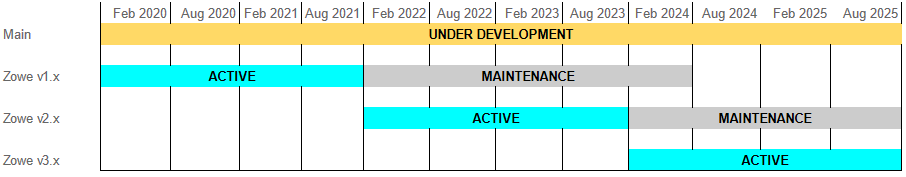

# Zowe Version Release Schedule

We release Zowe on a regular schedule. Major versions every two years. Minor versions on a schedule published in [Community repository](https://github.com/zowe/community/blob/master/Project%20Management/Schedule/Zowe%20PI%20%26%20Sprint%20Cadence.md). The minor changes shouldn't introduce breaking changes. We introduce the breaking changes only on the border of the major releases.

As a Zowe community we have three types of releases:

- Maintenance - This release receives only security patches and fixes for the critical bugs as outlined below. It's suitable for environment that prefers stability to new features.
- Active - This release receives updates regularly according to the schedule, and it is for the users that are willing to invest a bit more time into upgrades to get the latest features.
- Nightly - The Zowe publishes bleeding edge state of the project on the nightly basis. There are no guarantees around the stability of the build.

The latest release line is in the active category for 2 years. We will support older release lines in maintenance mode for 2.5 years. This support timeline allows us to support one active and one maintenance release line, along with a small window where we support one active and up to two maintenance release lines in parallel. We will aim to provide an upgrade path from one maintenance line to the next during that window, so users can remain on maintenance releases.

## Maintenance release

The maintenance release is not a regularly planned release. Unless absolutely required for an important security fix, a maintenance release should never introduce breaking changes. While introducing breaking changes is to be generally avoided for active releases, such changes should be entirely avoided for maintenance releases. It is difficult to pre-determine all of the conditions that point to when a Maintenance release is to be created. As such, the following points so not comprise an exhaustive list. Characteristics of what is considered a “critical” bug or defect include the following points:

- Security vulnerabilities that compromise data or system integrity
- Data corruption

## Active release

This release gets updates every 6 weeks according to the published schedule. The release contains fixes and new functionalities. The community focuses on not introducing breaking changes during an Active phase of release. On top of what is considered critical for Maintenance release this is considered critical for Active release:

- Unexpected downtime occurs or unacceptable performance
- No viable workaround can be provided through configuration workarounds
- Conformant applications no longer function as expected
- A fix can be made available without incurring a greater risk of introducing additional defects
- Critical business function is affected

## Under development

Development branch of the Zowe, which contains the code currently being worked on. We prepare the release every night and publish it. The main reason is to run the full CICD pipeline and give feedback to the squads around the integration of the Zowe components.

# Zowe Release Process

## Short Summary

1. Code Freeze date is hit
2. Every squad provides a version of the code to integrate into the Release Candidate (RC)
3. RC is built and tested with automatic test suite
4. RC is deployed and tested by squads.
5. RC is approved by the TSC vote
6. Release is published
7. Documentation is published
8. Release retrospective is held.

## Milestones and Release Candidates

Zowe Milestones are time-based releases with a schedule published on: [https://github.com/zowe/community/blob/master/Project%20Management/Schedule/Zowe%20PI%20%26%20Sprint%20Cadence.md#sprint-cadence](https://github.com/zowe/community/blob/master/Project%20Management/Schedule/Zowe%20PI%20%26%20Sprint%20Cadence.md#sprint-cadence). The schedule also contains dates for Code Freeze, RC builds, System Demo, and the expected publishing.

Each Squad decides if there will be a deliverable depending on the content that went into the Release. Squads are self-governing and are free to have their own schedules as long as they meet the requirements of the release as defined by the community.

Each squad is required to provide an older version of the component for release in case a stop-ship bug is found, and the fix cannot be delivered in time to meet the release date. The decision around the direction is taken by the release group.

For each release a release group is established. The group contains at least one member from each of the server side squads. The goal of this group is to coordinate the release process and keep its members updated on the status of each server squad. The responsibility of this group is also to decide what to do with the found bugs. Once there is an RC which this group believes should be released, the release group passes the relevant release to vote on to the TSC. The daily updates are posted to the appropriate channel so anyone can follow the current status.

## Release Approval Procedure

### Process when potential stop-ship was found

When any of the squads find or are informed about a potential stop-ship, the highest priority for the squad is to analyze the found issue and, within a day's time, come up with proposal about next steps. The other squads can continue testing. This is happening in context of the release group.

Potential proposals for resolution:
- Fix the issue and release a new version of the component. This contains info on when the fix will be available.
- Revert to previous version of the component
- Release despite known bug. Accept the bug as known, file it as an issue, and release despite the bug.

The decision what to do with a specific bug is up to the release group. If the group cannot come to a decision, it is possible to escalate to TSC.

### Approval of release passing the tests

The TSC is informed by the release group that a new release is ready for public distribution. The appointed member of TSC reviews the release and ensures that all requirements that are needed for legal and technical release are met.

The vote is conducted in the zowe-tsc channel as explained in the TSC Structure and TSC Charter. The option is to vote to release or to stop the release. When the votes approves the release, a TSC member, or the chair, notifies the release group. The release group then makes the artifacts available and notifies the OMP Director of the new release to track the LLC release of a new set of binaries.

If the decision is to stop the release TSC must propose alternative course of action.

## Release Numbering

Each release is identified by a version number. These numbers are used according to a specific scheme that provides additional information about the release. Version numbers are in the form x.y.z (Semantic Versioning) or major.minor.micro.

* The following semantic versioning the following sequences can be assumed MAJOR.MINOR.PATCH
  * MAJOR version when you make incompatible API changes
  * MINOR version when you add functionality in a backwards-compatible manner, and
  * PATCH version when you make backwards-compatible bug fixes.

The code can be found [here](https://zowe.org/download/).

The Release Candidates add RC to the end of the version and are not considered to be the official release. The RC build is not available directly on zowe.org/download, but can be found in Artifactory libs-release-local/org/zowe/.

Apart from the regular releases and Release candidates, we also promote nightly builds in libs-release-local/org/zowe/nightly/. The Zowe night build name will look like zowe-<version>-staging-<build-id>-<timestamp>.pax.

## Release Content

There are following parts build as a part of the release:

- z/OS Component
  * Convenience Build
  * SMP/E Build
- CLI component (Also downloadable from npmjs.org)
  * CLI Core
  * CLI Plugins
- Client SDKs
  * Node.js Client SDK
  * Python Client SDK
- Zowe Explorer (Only downloadable from Visual Studio Code Marketplace)
- Docker build (Tech preview) (Also downloadable from hub.docker.com)
  * amd64
  * x390x
- Source build

### The “CORE” Attribute

There are specific Zowe components that carry this designation. Core is loosely defined as a component of Zowe having the following characteristics:

- Is maintained by the Zowe community
- Is considered Vendor-neutral
- Is a package available for download from the Download page at https://Zowe.org unless otherwise directed via the  download section

This list identifies the specific Zowe V1 components designated as Core:

1. Zowe z/OS Convenience Build
    - Zowe v.r.m* z/OS Convenience build
    - Zowe z/OS SMP/E Build
2. Zowe 1.9.0 FMID AZWE001
    - Zowe v.r.m* PTF UOnnnnn** UOnnnnn**
3. Zowe CLI
    - Zowe v.r.m* CLI Core (or `@zowe/cli@zowe-v1-lts` and `@zowe/secure-credential-store-for-zowe-cli@zowe-v1-lts` on [public npm](https://www.npmjs.com/package/@zowe/cli))
4. Zowe Explorer
    - Listed as Visual Studio Code Marketplace (All versions available at https://marketplace.visualstudio.com/items?itemName=Zowe.vscode-extension-for-zowe )

*Where  v.r.m represents the continuous Zowe Version, Release, Maintenance levels associated with the specific packages.

** Where nnnnn represents a specific number associated with the PTF as listed on the download page.

## System demo

At release time, each Squad presents its work during the System demo. The System demo is open. Squads present new functionality introduced in the upcoming release. The schedule is presnted in the following document:[https://github.com/zowe/community/blob/master/Project%20Management/Schedule/Zowe%20PI%20%26%20Sprint%20Cadence.md#sprint-cadence](https://github.com/zowe/community/blob/master/Project%20Management/Schedule/Zowe%20PI%20%26%20Sprint%20Cadence.md#sprint-cadence) The meeting is recorded, and the recording is subsequently published.

## Post Release Activities

Once it has been decided to ship a release, the Zowe Build team publishes the deliverable along with all documentation.

After the release is concluded, there will be a retrospective on the release held, where the issues will be identified and from which will come the recommendations on the update to the release process and this document. The retrospective is prepared by the Zowe Build team and the TSC is responsible for it. 
