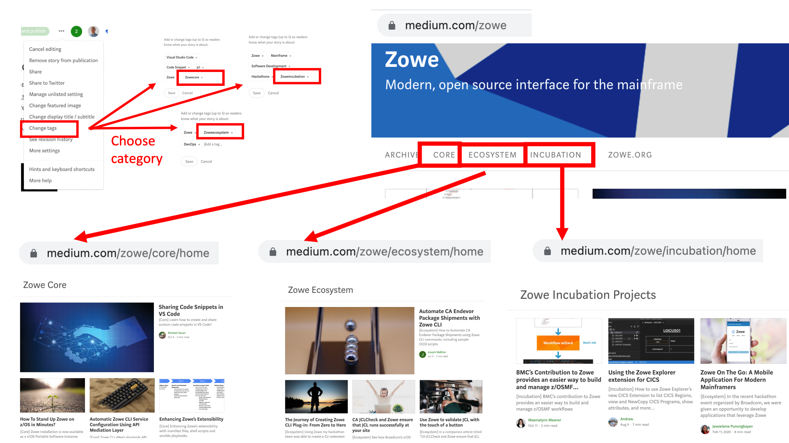
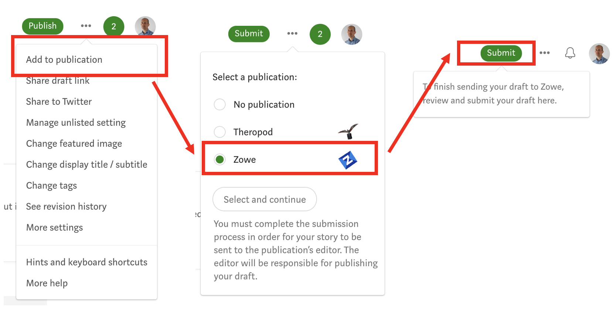

# Zowe Blog Guidelines

The blogsite https://medium.com/zowe is administered by the Open Mainframe Project (OMP).  To contact the team responsible for blog contents e-mail [zowe-blog-editors@openmainframeproject.org](email:zowe-blog-editors@openmainframeproject.org).

 - [Tracking of blogs](#tracking-of-the-blog-pipeline-and-publication-progress)
 - [Blog preparation](#blog-preparation)
 - [Publishing steps](#publishing-steps)
   - [When ready to write](#when-ready-to-write)
   - [Include OMP Branding](#include-omp-branding)
   - [When ready to publish](#when-ready-to-publish)
 - [Review Process](#review-process)
 - [Content Guidelines](#content-guidelines)
   - [Zowe General](#zowe-general)
   - [Zowe CLI](#zowe-command-line-interface-cli)
   - [Zowe API Mediation Layer](#zowe-api-mediation-layer)
   - [Zowe Desktop](#zowe-desktop)
   - [Zowe Explorer](#zowe-explorer)
   - [Zowe Incubation](#zowe-incubation)
 - [Personas](#personnas)
 - [Promotion](#promotion)


### Tracking of the blog pipeline and publication progress

- The pipeline of blogs for the [Zowe Medium Blog Site](https://medium.com/zowe) is available for viewing on a publicly accessible [KanBan board](https://github.com/orgs/openmainframeproject/projects/4).  This allows anyone to see what articles are being worked on by others prior to publication, and also for a blog author it let you see the status of your blog being edited as well as the assigned reviewers.  

## Blog preparation

**Blogs should:**

 - Be brief (generally < 1200; > 500 words)
 - Focus on a target audience
 - Be relevant
   - The title and first paragraph should compel the viewer to take the time to read the piece.  The content should be relevant and helpful for the target audience.
 - Leverage visuals (screenshots, GIFs, etc.), especially an eye-catching featured image  
   - See public, license-free sites like unsplash.com

**Discoverability (search results):**

 - Determine which Google search keywords are best suited for your content and target audience (i.e., what are you communicating and to whom?  What keywords are they likely to use?).  Include these keywords in your title and related words in the body, especially the first paragraph.

 - Be sure your title, opening paragraph (and featured image) will stand out in a search by your target audience (i.e., will it get people to click your entry over all the other Google results?)

## Publishing steps

 - Create a Medium handle.  
 - Let [zowe-blog-editors@openmainframeproject.org](email:zowe-blog-editors@openmainframeproject.org) know your handle so you can be added as a “writer” for the publication.  To see your handle, select your profile picture when you log into medium.com, it will begin with an `@` symbol, e.g. `@myusername_1974.  

### When ready to write

 - Go to the Zowe blog [KanBan board](https://github.com/orgs/openmainframeproject/projects/4) to see what other blogs are being worked on in case there is a blog already being authored/prepared on the same topic.  See also [Tracking of blogs](#tracking-of-the-blog-pipeline-and-publication-progress)
 - Go to [Medium.com](https://medium.com)
 - Click your profile (should be logged in)
 - Click New Story

### Writing your blog

 - Begin editing
 - If needed, save as “draft”
 - Include the following sentences at the end of your blog, shown below as it should appear.  
 - "If you enjoyed this blog checkout more [Zowe blogs here](https://medium.com/zowe). Or, ask a question and join the conversation on the [Open Mainframe Project Slack Channel](https://openmainframeproeject.slack.org) #Zowe-dev, #Zowe-user or #Zowe-onboarding. If this is your first time using the OMP slack channel register [here](https://slack.openmainframeproject.org)."
   ```
   Raw markdown for the slack channel paragraph:
   
   If you enjoyed this blog checkout more [Zowe blogs here](https://medium.com/zowe). Or, ask a question and join the conversation on the [Open Mainframe Project Slack Channel](https://openmainframeproeject.slack.org) #Zowe-dev, #Zowe-user or #Zowe-onboarding. If this is your first time using the OMP slack channel register [here](https://slack.openmainframeproject.org).
   ```

**Please do not publish your own post.**

### Include OMP Branding

 - At the first mention of Zowe use the branding phrase `Open Mainframe Project's Zowe`  with hyperlinks to https://www.openmainframeproject.org/ and https://www.openmainframeproject.org/all-projects/zowe.  An example of this is the sentence below as it should appear in the blog.
 - "This blog describes how to obtain and install The [Open Mainfranme Project's](https://www.openmainframeproject.org/) [Zowe](https://www.openmainframeproject.org/all-projects/zowe) command line interface."
   ```
   Raw markdown for the OMP branding example:
   
   This blog describes how to obtain and install The [Open Mainfranme Project's](https://www.openmainframeproject.org/) [Zowe](https://www.openmainframeproject.org/all-projects/zowe) command line interface.  
   ```

**Please do not publish your own post.**

### When ready to publish

 - You may need to add the publication to your profile (Profile => Publication => New Publication)
 - Double check: be sure you have...
   - compelling title and opening paragraph (discoverability is critical!)
   - featured image and visuals in place.  By default, the first image will be associated with the blog post, however you can choose to use a different headline image by navigating to the image while in edit mode, select it manually, and press `Shift + F`. 
   - appropriate links and tags
 - Include 4 tags like: `Zowe`, `Mainframe`, `DevOps`, `Open Source`, [specific technology like `COBOL`, `VSCode`], [specific roles like `Sysprog`], etc.  There are 5 tags allowed per article, and one of them must be used to categorize the blog as `Zowecore`, `Zoweincubation` or `Zoweecosystem`.  See [Zowe Core](#zowe-core), [Zowe Ecosystem](#zowe-ecosytstem), and [Zowe Incubation](#zowe-incubation).

 <p align="center">
 
</p>

 - While editing the story, click “…”, click "Zowe" and click “Add to Publication”
 - If applicable, uncheck “Allow curators to recommend my story to interested readers.”
 - Click “Submit to Publication”
 - The blog will remain Pending until the publication owner posts it

<p align="center">
 
</p>

**Please do not publish your own post.**

 ## Review Process

  - 2 members of the project from different companies will be assigned to review for technical details.  
  - The reviewers will work with the author for any updates or changes required, as well as any categorization of the blog for {Core} or {Ecosystem}.
  - OMP team will do final check for grammar and branding
  - OMP will schedule it and promote via social media
  - OMP team will let author know publication date and share via social media
  - To check on the status of your blog check the Zowe blog [KanBan board](https://github.com/orgs/openmainframeproject/projects/4).  This will let you see the reviewers who are editing your blog as well as read and add any github comments regarding its publication.  See [Tracking of blogs](#tracking-of-the-blog-pipeline-and-publication-progress)
  
  **Please do not publish your own post.**

 ## Content guidelines

 As a blog writer you can write about any topic that you're interested in and that will provide value to the Zowe community. The content on our blog consists of:

 - Articles about core Zowe projects, Zowe incubation projects, or Zowe conformant offerings
 - Technical content and how-to's
 - Stories about Zowe deployments
 - Use cases and success stories
 - Reports from Zowe events

 Other topics are welcome, but it needs to have a direct link to the Zowe community
 
 Blogs fall into one of three categories and are differentiated to avoid a user visiting a Zowe blogsite from misunderstanding the relationship between whether the content being described is free open source software included with a Long Term Support (LTS) Zowe release, a commercial vendor Zowe offerings, or a project in its incubation phase.

 Posts are vendor-neutral, although the author is allowed to describe their bio in relation to their role at a commercial company, (e.g. Janet is lead systems programmer at mainframewidgets.com), including links to social media handles.

 - [Zowe General](#zowe-general)
 - [Zowe CLI](#zowe-command-line-interface-cli)
 - [Zowe API Mediation Layer](#zowe-api-mediation-layer)
 - [Zowe Desktop](#zowe-desktop)
 - [Zowe Explorer](#zowe-explorer)
 - [Zowe Incubation](#zowe-incubation)

### Zowe General
 
 These articles reference content that is owned and managed by the Open Mainframe Project residing as source code in [https://github.com/zowe](https://github.com/zowe) repository.

 Zowe General articles are published on [https://medium.com/zowe](https://medium.com/zowe/general/home).

 Blogs that meet the criteria for Core Zowe should have the word [`{Core}`](https://github.com/zowe/community/blogging/blog_guidelines.html#zowe-core) as the first word of the first sentence of the article which should be a hyperlink to the URL https://github.com/zowe/community/blogging/blog_guidelines.html#zowe-core.  This allows a reader to easily see that the content relates to core Zowe functionality. 

 An example of a Zowe General blog is [Installing Zowe on z/OS](https://medium.com/zowe/installing-zowe-on-z-os-de69ec5412ff) that discussed how to install, configure and launch a Zowe convenience build.  

### Zowe Command Line Interface (CLI)

 These articles reference content that is owned and managed by the Open Mainframe Project residing as source code in [https://github.com/zowe/zowe-cli](https://github.com/zowe/zowe-cli) repository.

 Zowe CLI articles may reference other open source technologies such as [Visual Studio Code](https://code.visualstudio.com/), [Jenkins](https://www.jenkins.io/), and other products available under OSI approved licenses.
 
 Posts are vendor-neutral, although the author is allowed to describe their bio in relation to their role at a commercial company, (e.g. Janet is lead systems programmer at mainframewidgets.com), including links to social media handles.
 
 An example of a blog about the Zowe CLI is [Setting up CA Endeavor for Zowe CLI](https://medium.com/zowe/setting-up-ca-endevor-for-zowe-cli-d8833a8312ee).

### Zowe API Mediation Layer

 These articles reference content that is owned and managed by the Open Mainframe Project residing as source code in [https://github.com/zowe/api-layer](https://github.com/zowe/api-layer) repository.

 An example of a Zowe API ML blog is [Two Peas in a Pod — Endevor and the Zowe API Mediation Layer](https://medium.com/zowe/two-peas-in-a-pod-endevor-and-the-zowe-api-mediation-layer-2b6c23306b33) that discussed one of the vendor solutions of Zowe and why users should integrate this solution with Zowe API ML.

### Zowe Desktop

 These articles reference content that is owned and managed by the Open Mainframe Project residing as source code in [https://github.com/zowe](https://github.com/zowe) repositories.

 Zowe Desktop articles may reference Zowe Application Framework content including the Virtual Desktop, Editor, IP information, JES Explorer, SSH App, and TN3270 App. 
 
 An example of a Zowe General blog is [How To Become A Zowe Desktop Application Developer](https://medium.com/zowe/how-to-become-zowe-desktop-application-developer-5c2bda12feba) that discussed how to become a Zowe Desktop developer and how the IP Explorer was born. 

### Zowe Explorer

 These articles reference content that is owned and managed by the Open Mainframe Project residing as source code in [https://github.com/zowe/vscode-extension-for-zowe](https://github.com/zowe/vscode-extension-for-zowe) repositories.

 Zowe Explorer articles may reference other open source technologies such as [Visual Studio Code](https://code.visualstudio.com/), [Jenkins](https://www.jenkins.io/), and other products available under OSI approved licenses.
 
 Posts are be vendor-neutral, although the author is allowed to describe their bio in relation to their role at a commercial company, (e.g. Janet is lead systems programmer at mainframewidgets.com), including links to social media handles.

 An example of a Zowe General blog is [Secrets for Zowe SDK](https://medium.com/zowe/secrets-for-zowe-sdk-d8f6a485c7ae) that discussed how Zowe Explorer extenders use the keyring module (using Secrets SDK).

### Zowe Incubation

Zowe provides for projects to be in incubation that may not be currently in core Zowe. There is value in promoting and sharing these projects with the Zowe community and articles written about technology in the incubation phase are welcome to be written about in the Zowe blogsite.  The definition of a Zowe incubation project is mediated by the Zowe Leadership Committee (ZLC).

A reader of the Zowe blogsite should be able to recognize that the content relates to a Zowe incubation project that may be outside of the core Zowe Long Term Support (LTS).  Incubation blogs should have the word [`{Incubation}`](https://github.com/zowe/community/blogging/blog_guidelines.html#zowe-incubation) as the first word of the first sentence of the article that hyperlinks to the URL https://github.com/zowe/community/blogging/blog_guidelines.html#zowe-incubation.  

## Personas
 
 The Zowe community is made up of a number of different personas

 - **Users**.  
   - Mainframers who are using Zowe technology, covering its components Zowe Explorer, Zowe desktop, API Mediation Layer or Command Line Interface.  This includes developers, system programmers, devops pipeline engineers, ...
 - **Administrators**.  
   - Mainframers who are concerned with installing, configuring, tuning, managing Zowe distributions on behalf of users.
 - **Architects**.  
   - Software architects interested in articles that cover broad topics relates to positioning Zowe rather than end user articles.  Architectural blogs will likely have a higher content of diagrams and background, whereas a user article might have more screen shots and hands on code-snippets.

To help blog readers navigate between posts for different personas, there are specific sections titled `For Users`, `For Administrators` and `For Architects`.  The persona will be applied by the editors reviewing and accepting the blog content, although a writer may indicate when they submit a blogpost which persona they have in mind their audience.

## Promotion

Your blog will be shared on the Open Mainframe Project's [twitter](https://twitter.com/OpenMFProject) and [linkedIn](https://www.linkedin.com/company/the-open-mainframe-project/) channels.  
